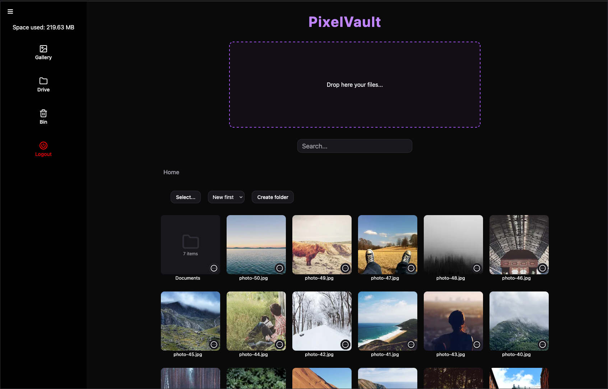

# PixelVault

A self-hosted media vault: upload photos and videos, arrange them into folders, and restore them from the bin when you delete the wrong item.

Built as a full-stack project with no framework scaffolding. The folder tree, the trash semantics and the move logic are all hand-rolled, which is where most of the work and the decisions live.

## Stack

**Frontend** — React, TypeScript, Vite, CSS Modules. No external UI library. No state manager by design: local states are kept in components and custom hooks. Shared state is propagated over context.

**Backend** — Fastify, TypeScript, Drizzle ORM, PostgreSQL. JWT auth over httpOnly cookies. Thumbnails generated with sharp, video probing with ffprobe.

## What it does

- Upload images and videos, with thumbnails generated server-side
- Navigate down into folder trees with breadcrumb navigation
- Rename, single and bulk move with navigation modal
- Trash with restore and permanent delete, both scoped to the same batch
- Search, sort, storage usage
- Lightbox for images and video playback
- Registration and login

## Design decisions

**The trash is a flag, not a folder.** When an item is deleted, `deletedAt` is set to the current timestamp. Nothing moves and no reference to parent folder is updated. On the other hand, some important products (like MEGA) implement the bin as a real node, so deleting is a real move. But in this way the app needs to store the reference to the original parent in order to do a restore in place. 
So keeping the item in the same position with a deleted flag lets the app keep such reference without having to save it separately.

**Timestamp is the batch id.** All the items deleted in the same request share the exact same `deletedAt` value. This is because in the same request a single `new Date()` value is calculated at the beginning of the execution and kept the same through the whole update process.
Using the `deletedAt` like this lets the app know if a parent folder was deleted together with the children or they were deleted separately. 
This drives 3 things:
- If a child is shown nested under its parent or at root level in the trash. The child is shown at root level when it's deleted in a different batch from its parent;
- What a permanent delete is allowed to destroy. Permanent delete only destroys its children nested inside and ignores the children at root level;
- What a restore brings back, as it only restores the selected item and its children nested inside and ignores the children at root level.

Example: deleting separately `photo.jpg` and the folder that contains it produces two separate entries in the trash (photo and folder), and permanently deleting the folder leaves the photo alone. Deleting the folder directly, with the photo still inside, produces a single entry instead (folder and photo nested inside).

**No `ON DELETE CASCADE`.** Consistency of the DB is enforced by server logic not by DB triggers. When deleting a parent folder, relying on the on delete cascade statement would delete all the entries from the DB but ignore all the files in the disk storage.
All the descendants are collected from the server route and used both to delete entries from the DB and to remove files from disk storage.

**`ON DELETE SET NULL`.** On delete set null is used instead as self referencing foreign key. This covers the only case that survives a delete: an item deleted in its own batch, whose parent folder is then permanently deleted. 
Example: I delete `photo.jpg`, then later delete the folder `Holidays` that contains it, then permanently delete `Holidays`.
The photo is not destroyed, because it belongs to a different batch. Without `SET NULL` the photo's `parentId` would point to a row that no longer exists. With `SET NULL` the photo is unlinked, and it goes back to the trash root level and can still be restored.

**Self reference cycle prevention.** The server has a guard preventing a folder from being moved under its own descendant, as it would corrupt the folder tree.
This could not be done in the DB as foreign keys can't control over multi-rows cyclic reference. Postgres only evaluates each row in isolation.

**Bulk operations resolve before they mutate.** Restoring multiple items had a bug worth explaining here. For each item the route had to decide if the parent link should be cleared or not, and this was decided by reading the parent state inside the loop. But the same loop was already changing that state while running. 
Example: Bulk restoring together a folder and one of its children, both deleted in different batches. If the child is processed first the parent is still deleted, so the link is cleared and the child ends up at root level. If the folder is processed first the link is kept and the child stays inside. Same request, same items, different result only because of the order the ids arrived in. 
Now the route collects the whole affected subtree first, and bulk updates the set so the order of the ids does not matter.

## Roadmap

- **v1.1** — responsive layout and improved UI/UX (desktop only for now)
- Deployment
- Encryption: files encrypted before upload, server stores ciphertext it cannot read
- Semantic search over image content

## Status

Stable v1 with basic drive manager functions. No automated tests yet.
