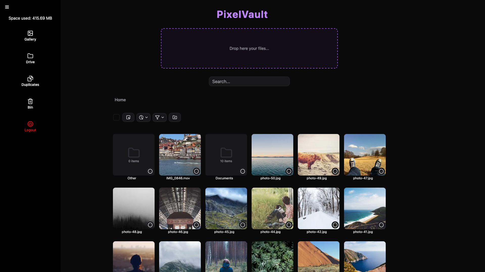
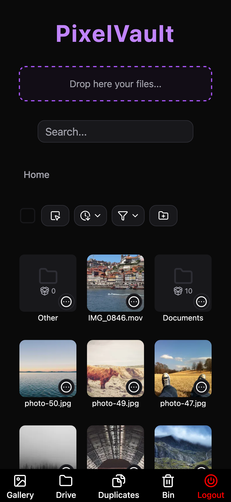

# PixelVault

A self-hosted cloud storage for photos, videos and files, used every day from a phone and running in production on a Linux server at home.

Built as a full-stack project with no framework scaffolding. The folder tree, the trash semantics, deduplication and file access are all hand-rolled, which is where most of the work and the decisions live.

  
  &nbsp;
  

## Stack

**Frontend:** React, TypeScript, Vite, CSS Modules. No external UI library. No state manager by design: local state lives in components and custom hooks, and shared state is propagated through context.

**Backend:** Fastify, TypeScript, Drizzle ORM, PostgreSQL. JWT auth over httpOnly cookies, rate limiting and security headers. Thumbnails generated with sharp, video probing and thumbnails with ffmpeg.

**Testing and deployment:** Vitest integration tests against a real PostgreSQL database, run in GitHub Actions together with type checks, lint and dependency audits. Deployed on a home Ubuntu server, with files stored on an external disk.

## What it does

- Upload photos, videos and files up to 5 GB, streamed to disk, with thumbnails generated server-side
- Navigate folder trees with breadcrumbs, filter by type, search and sort
- Rename, single and bulk move, select all, bulk delete
- Trash with restore and permanent delete, both scoped to the same batch
- Duplicate detection: identical files are skipped when uploaded into the same folder, and a dedicated view groups the existing duplicates
- Lightbox with swipe navigation for photos and video playback
- Downloads with the original file names
- Mobile-first interface: icon toolbar, touch targets, swipe gestures

## Design decisions

**The trash is a flag, not a folder.** When an item is deleted, `deletedAt` is set to the current timestamp. Nothing moves and no reference to parent folder is updated. On the other hand, some other important products implement the bin as a real node, so deleting is a real move. But in this way the app needs to store the reference to the original parent in order to do a restore in place. 
So keeping the item in the same position with a deleted flag lets the app keep such reference without having to save it separately.

**Timestamp is the batch id.** All the items deleted in the same request share the exact same `deletedAt` value. This is because in the same request a single `new Date()` value is calculated at the beginning of the execution and kept the same through the whole update process.
Using the `deletedAt` like this lets the app know if a parent folder was deleted together with the children or they were deleted separately. 
This drives 3 things:
- If a child is shown nested under its parent or at root level in the trash. The child is shown at root level when it's deleted in a different batch from its parent;
- What a permanent delete is allowed to destroy. Permanent delete only destroys its children nested inside and ignores the children at root level;
- What a restore brings back, as it only restores the selected item and its children nested inside and ignores the children at root level.

Example: deleting separately `photo.jpg` and the folder that contains it produces two separate entries in the trash (photo and folder), and permanently deleting the folder leaves the photo alone. Deleting the folder directly, with the photo still inside, produces a single entry instead (folder and photo nested inside).

**No `ON DELETE CASCADE`.** Consistency of the DB is enforced by server logic not by DB triggers. When deleting a parent folder, relying on the on delete cascade statement would delete all the entries from the DB but ignore all the files in the disk storage.
All the descendants are collected from the server route and used both to delete entries from the DB and to remove files from disk storage.

**`ON DELETE SET NULL`.** The self referencing foreign key on `parentId` uses `ON DELETE SET NULL` instead, so that the relationship with the parent is deleted when the parent is permanently deleted. This covers the only case that survives a delete: an item deleted in its own batch, whose parent folder is then permanently deleted.
Example: I delete `photo.jpg`, then later delete the folder `Holidays` that contains it, then permanently delete `Holidays`.
The photo is not destroyed, because it belongs to a different batch. Without `SET NULL` the photo's `parentId` would point to a row that no longer exists. With `SET NULL` the photo is unlinked, and it goes back to the trash root level and can still be restored.

**Self reference cycle prevention.** The server has a guard preventing a folder from being moved under its own descendant, as it would corrupt the folder tree.
This could not be done in the DB as foreign keys can't control over multi-rows cyclic reference. Postgres only evaluates each row in isolation.

**Bulk operations resolve before they mutate.** Restoring multiple items had a bug worth explaining here. For each item the route had to decide if the parent link should be cleared or not, and this was decided by reading the parent state inside the loop. But the same loop was already changing that state while running. 
Example: Bulk restoring together a folder and one of its children, both deleted in different batches. If the child is processed first the parent is still deleted, so the link is cleared and the child ends up at root level. If the folder is processed first the link is kept and the child stays inside. Same request, same items, different result only because of the order the ids arrived in. 
Now the route collects the whole affected subtree first, and bulk updates the set so the order of the ids does not matter.

**Uploads are streamed, then analysed from disk.** Buffering a whole upload in memory capped the file size at the server's RAM, and real videos are several gigabytes. The upload is now streamed straight to a temporary file, and every later step (file type detection, metadata, thumbnail, hash) reads from that file. The order changed, not the steps: most libraries already accept a path instead of a buffer.

**Duplicates are detected by content, not by name.** Every file is hashed with a streamed SHA-256 after it reaches its final form on disk, so a converted HEIC is hashed as the JPEG that is actually stored. The same file is skipped when uploaded into the same folder, but accepted in a different one: the check guards the entry point, and a dedicated view shows the duplicates that already exist. In that view, selecting all picks every copy except the oldest, so a bulk delete can never remove all of them.

**Files are served only through authenticated routes.** There is no public static folder. Originals and thumbnails are streamed by routes that check the session and the owner, and an id that belongs to another user returns 404 instead of 403, so the response does not reveal that the file exists.

## Roadmap

- HTTPS on the local network and remote access through a self-hosted VPN
- Semantic search over image content with CLIP embeddings and pgvector
- Background workers for heavy processing, starting with video compression
- Map view of photos from their GPS metadata

## Status

In daily use, deployed on a home Linux server. The trash and folder tree logic is covered by integration tests that run in CI on every push to main and on pull requests; the tests for authentication and file access are next.
